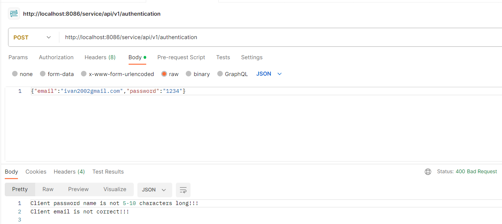

Проект: Приложение для работы с сущностью Клиент с использованием spring IoC в качестве средства для внедрения зависимостей.

Запуск приложения:
1. скачать проект;
2. в командной строке перейти в папку, где находится файл docker-compose.yml и выполнить команду docker-compose up -d

Автоматически при запуске контейнера с postgres произойдет создание базы данных, а при запуске контейнера с tomcat, где развернуто приложение - произойдет создание таблиц  (clients, user_credential, uuid_token - используется liquibase) и заполнение таблицы clients первичными данными.

В приложении имеются следующие возможности:
1. создание нового Клиента с помощью json (POST "/service/api/v1/clients");
2. получение Клиента по id (GET "/service/api/v1/clients/{id}") с сохранением в pdf
3. обновление Клиента по id (PUT "/service/api/v1/clients/{id}")
4. удаление Клиента по id (DELETE "/service/api/v1/clients/{id}")
5. получение Клиентов с пагинацией и сортировкой (GET "/api/v1/clients"), с параментрами page - страница, pagesize - количество Клиентов на странице (если не задано, по умолчению 20) и sorting - по чем сортировать (если не задано - сортирует по имени).
6. создание нового Клиента с помощью xml (POST "/service/api/v1/clients_xml");

Доступ ко всем перечесленным выше эндпойнтам происходит через фильтр, то есть только аутентифицированные Пользователи имеют доступ к этим ресурсам.
Имеется возможность зарегистрироваться с помощью логина (email) и пароля (POST "/service/api/v1/authentication") и после получить токен для доступа ко всем ресурсам (GET "/service/api/v1/authentication).
Только те Пользователи, которые имеют валидный токен могут получить доступ к работе с Клиентами.

Пример работы.
1. Регистрируем нового Пользователя


При регистрации Пользователя происходит его валидация, то есть email должен быть валидный, а пароль должен быть длиной от 5 до 10 символов, если они не валидные, выводится сообщение об этом.



Если валидация происходит успешно - Пользователь сохраняется в базу данных.

2. Далее необходимо получить токен, для этого необходимо отправить свои логин и пароль.


Происходит поиск Пользователя по логину в базе и сверяется его пароль, если все совпадает сервер выдает токен, который сохраняет для данной сессии в базе данных.

Если нет такого логина или пароль не совпадает - выводится соответствующее сообщение.


3. После получения токена можно работать с сущностью Клиент.

**Получить Клиента по id.**

Для этого надо в Headers передавать токен (uuid_token).


Идет проверка валидности токена, если он валидный для данного Пользователя - есть такой же токен в базе данных, то доступ разрешен. Если токен не валидный - выводится соответствующее сообщение.


Также происходит сохранение Пользователя в pdf в папку D:/Downloads/pdf/reports/info_about_client


После завершения работы все токены удаляются.

**Добавить Клиента**

Пример Клиента в формате json:
```
{"firstName":"Ivan","lastName":"Ivanov","email":"ivan122000@mail.ru","telephone":"+375291234567","birthday":"2023-09-12","registrationDate":"2023-06-30T20:37:12"}
```


Если данные по Клиенту не валидны - выводится сообщение в чем ошибка.


**Редактировать Клиента**


**Удалить Клиента**


Если Клиент с таким id не найден выводится сообщение об этом.


**Сохранить Клиента из xml**

Пример Клиента в формате xml:
```
<ClientDto><firstName>Ivan</firstName><lastName>Ivanov</lastName><email>ivan2000@mail.ru</email><telephone>+375291234567</telephone><birthday>1984-09-12</birthday><registrationDate>2023-01-15T15:35:00</registrationDate></ClientDto>
```


**Получить всех Клиентов с пагинацией и сортировкой**

Сортировать можно по имени (sorting = "first_name" - по умолчению), по дате рождения (sorting = "birthday") и по дате регистрации (sorting = "registration_date").


Для этого необходимо вместе с запросом передать три параметра page - номер страницы, pagesize - количетсво Клиентов на странице и sorting - по чем сортировать (имени, дате рождения или дате регистарции). Если pagesize не задан, то используется значение по умолчению - 20. Если sorting не задан сортируется по умолчению по имени.

В приложении происходит валидация данных Клиента и если введены некорректные данные будет выброшена ошибка с описанием проблемы.

Валидация данных:
1. проверка имени Клиента на null и empty;
2. проверка фамилии Клиента на null и empty;
3. проверка имени Клиента на длину от 2 до 10 символов;
4. проверка фамилии Клиента на длину от 2 до 30 символов;
5. проверка на корректность электронной почты;
6. проверка номера телефона на наличии знака "+" в начале номера;
7. проверк номера телефона на наличие 12 цифр.